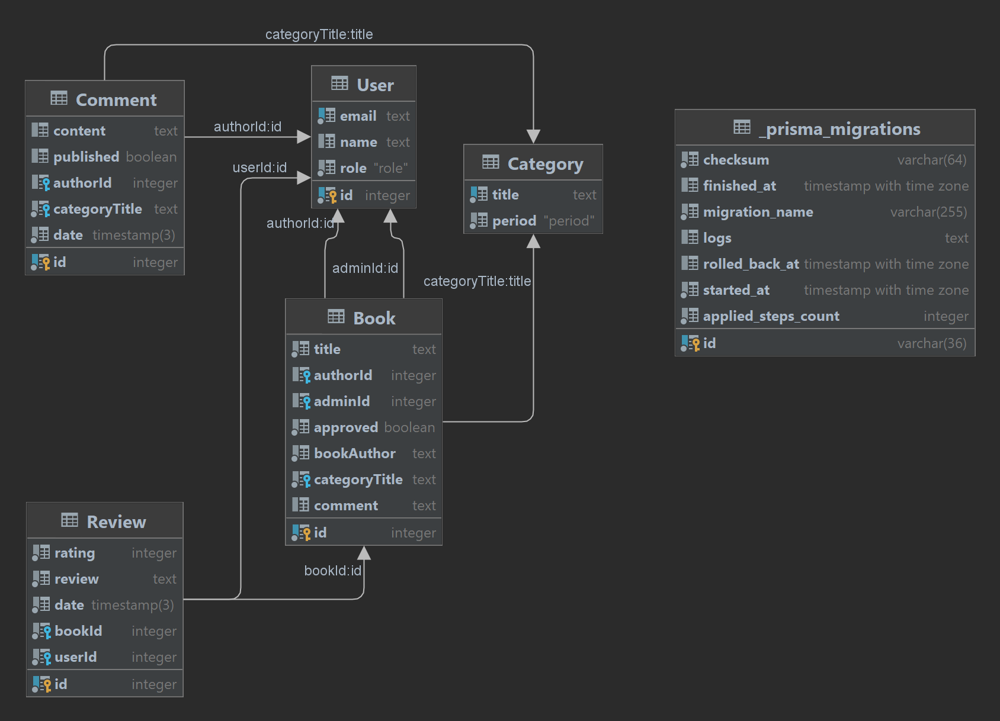

# ITMO-Web
Иванов Никита М33011

## Тема:
Сайт, посвященный творчеству В.В. Набокова, с кратким описанием каждого романа и информацией о литературоведческих работах

## Макет:

***
* ## Сущности ~в виде гномика~ в базе данных

### User (Пользователь (Юзер))
Имеет поля id, почты (она же логин), пароля и роли в системе - просто пользователь или админ
### Book (Книга (Kniga))
Основная сущность в системе, с полями: заглавие, автор книги, описание (комментарий), id пользователя, занесшего книгу в систему, id админа, подтвердившего изменение, категория, к которой принадлежит книга.
### Category (Категория (интуитивно билингвистическое слово))
Категория, к которой относится предложенная книга. Поле заголовок - биографияеский материал, исследование конкретного произведения, разнородные материалы и т.д. и поле период - русский либо американский (для вывода на соответствующей странице сайта)
### Review (Отзыв (не ревью))
Отзыв к книге. Поля - рейтинг (от 0 до 10), собственно отзыв, дата публикации, id книги и id пользователя-автора отзыва
### Comment (Коммент (комментарий))
Комментарий в обсуждение категории. Поля - контент, опубликован или нет, дата публикации, название категории, id автора
### _prisma_migrations
Я боюсь его удалять даже из диаграммы, вдруг все сломается
